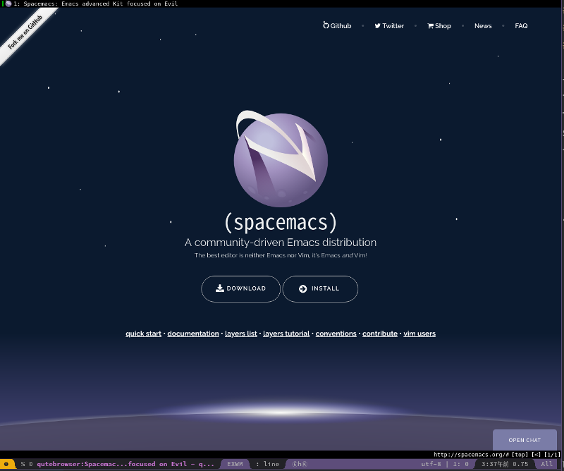
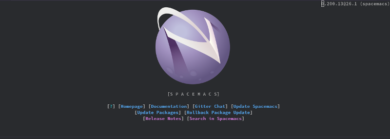

(c) [nashamri](https://github.com/nashamri/spacemacs-logo)

 
「私たちが見知らぬ惑星に降り立ってから数日がたった」  
「ここは地球です」  
「その地表は紫色で，組成は不明」  
「Emacs Lisp です」  
「空には土星の環を彷彿とさせる帯がはしり」  
「アイコンの模様です」  
「生物や水の痕跡さえもない」  
「ソフトウェアですから」  
「果たして私たちは生きてここから脱出することはできるのだろうか？」  
「ヘルプが必要ですか？ **SPC h** を入力してください」

「もう!」私が机に手をつき，ThinkPad をにらむ。「せっかく雰囲気が盛り上がってきたのに，いちいち現実に引き戻さないでよ」「妄想に逃げても操作は上達しませんが」「そんなのわかってるよ。けどさぁ…」

ThinkPad は『[Emacs のチュートリアルをプレイ。](https://jamcha-aa.github.io/Emacs-tutorial/)』で加わった，私のアシスタントだ。はじめはコンピュータらしく，無口で，黙って私の作業をこなすだけだった。だが私があまりにも頼りないので，次第に手取り足取り私を助けるようになった。ふだんは冷たい物言いばかりするものの，私が長時間作業を続けているときに休憩を勧めてきたり，栄養が偏らないように食事メニューを提案してくれたりする。

そんな私の ThinkPad は，それまでアシスタントを務めていた EeePC に比べて圧倒的に高いマシンスペックを誇る。誇ってはいないけれども，重い処理でも難なくこなし，それを喜ぶ私に「何ですか？にやにやして気味が悪いです」と涼しい顔でいる。私は危険な誘惑にかられた。話題の『[Spacemacs](https://spacemacs.org/)』を ThinkPad で試したくなったのである。

Spacemacs。その画面を初めて見た感想は『かっこいい』であった。だが EeePC では重くてまともに動かないだろうとも思った。しかもこれまでの Emacs と操作性が全く違うのもこわい。インストールも難しそう。目的が定まらないまま導入すればどんな危険な目にあうか知れない。そんなわけで，Spacemacs に対してはあこがれと不安が入り交じった気持ちをずっと抱いてきたのだ。

ところが状況は一変した。ThinkPad があまりに平然と作業をこなすので，意地悪をしたくなったのである。Spacemacs を入れたらどれだけ動作が重くなるだろう。軽快に動けばさすが ThinkPad だし，もたもたすればからかってやれる。まあ，重くなって実際に困るのは私なのだが，それよりも ThinkPad を困らせたかったのだ。

 
「ねえ，Spacemacs 試してみない？」「Spacemacs …」ThinkPad は瞬時に検索し，公式ページを表示する。私の悪意も知らず，健気なことだ。

「こちらでよろしいですか？」

 

 
「ありがと」私はお礼を言ってホームページを眺める。かっこいい。spacemacs をカッコで閉じているのは Lisp を表現しているのだろう。

※なお，このスクリーンショットが Spacemacs をインストールした環境で撮影されているという点は見逃していただきたい。

私はインストール方法を確認するため "INSTALL" をクリックした。

 

    git clone https://github.com/syl20bnr/spacemacs ~/.emacs.d

 
「!」驚いた。「これ，Emacs の設定ファイルなんだ」

Spacemacs は [gnupack](http://gnupack.osdn.jp/docs/latest/UsersGuide.html)のようにアプリケーションとして配布されているとか，もしくはソースからコンパイルするものとばかり思い込んでいた。まさか Emacs の設定ファイルだったとは。面倒な設定が必要ないぶん，気軽に試しやすい。

私はこれまで使っていた.emacs.d ディレクトリを bak.emacs にリネームする。ターミナルでコマンドを打ち，ダウンロードが終わるのを待ってから Emacs を起動した。

 

    emacs

 
起動した Emacs に次々とパッケージがダウンロードされてゆく。まるで OS のインストール画面を眺めているようだ。

やがて準備が完了したことを示すように，クイックヘルプが表示される。新たな星に足を踏み出す気分だった。

 

